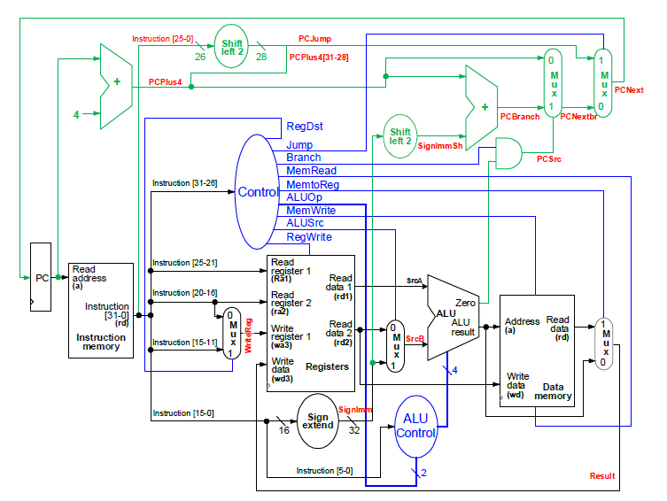
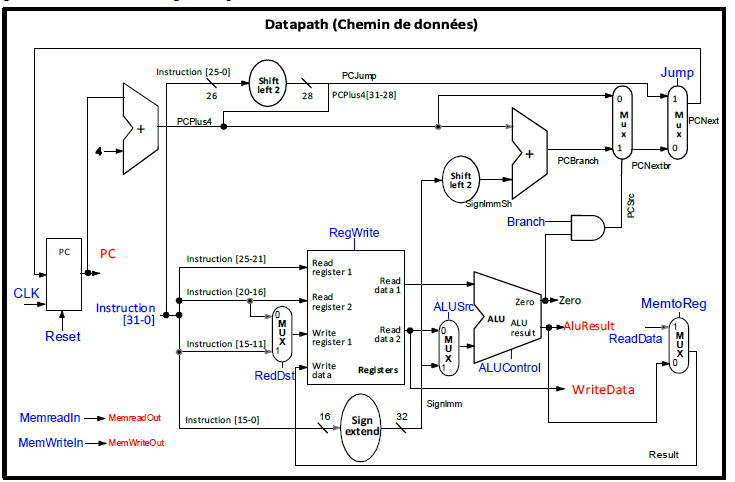
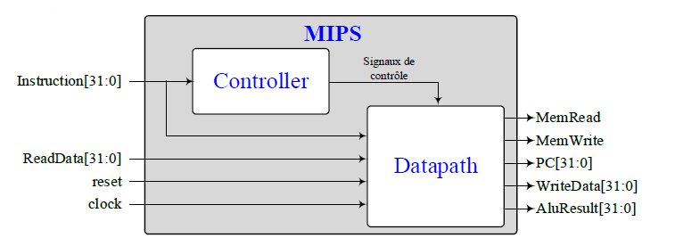
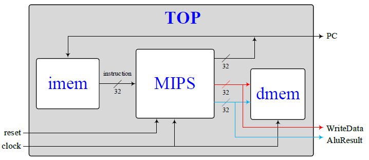

Dans le cadre du cours ELE344 (Conception et architecture de processeurs), nous avons dû réalisé un processeur MIPS 32bit.

## Architecture Processeur

    

## Architecture Datapath

    

## Architecture MIPS

    

## Architecture Top

    

