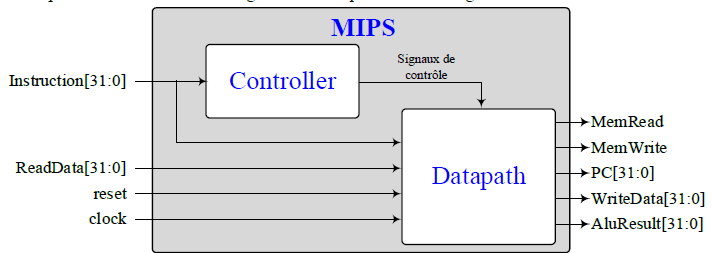

Dans le cadre du cours ELE344 (Conception et architecture de processeurs), nous avons dû réalisé un processeur MIPS 32bit.

## Architecture Processeur
Voici l'architecture du processeur nous allons le diviser en plusieurs morceaux pour facilité la lecture.
C'est partie sont le datapath, le MIPS et le TOP

    

## Architecture Datapath
Le datapath est le chemin de connection du processeur MIPS, il connecte tout les élement utilisé pour faire les opérations demandé.
| Composant  | Fonction |
| ------------- | ------------- |
| PC | Contient l'adresse de la prochaine instruction |
| Register | Registre de donnée |
| ALU | Unité aritmétique et logique conçue dans le cadre du cours [Projet 1](https://github.com/etiennedesrochers/ELE344-Projet-1-UAL). |

    

## Architecture MIPS
Le MIPS connecte le datapath et le controlleur de signal

    

## Architecture Top
Le top connecte le MIPS, le imem(Intruction) et le dmem(mémoire RAM)

    

